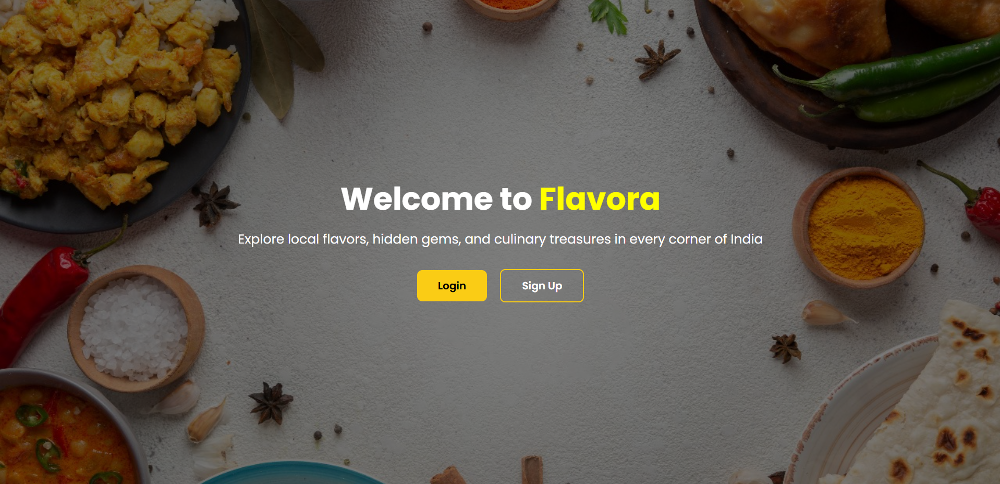

# 🥘 Flavora – Discover Authentic Indian Flavors

**Flavora** is a responsive and visually rich web interface that showcases the diversity of Indian cuisine. Built using HTML, Tailwind CSS, and JavaScript, it allows users to explore food experiences and interact through login and signup sections with smooth transitions and notifications.

---
## 🌟 Features

- 🔐 Login and Sign-up interface with validation  
- 🍽️ Interactive buttons and smooth section transitions  
- 🏙️ Find the most iconic dishes from your favorite Indian cities  
- 🔔 Toast notifications for user feedback  
- 🎨 Styled with Tailwind CSS and custom design  
- 📱 Fully responsive layout for all devices  

---

## 🛠️ Tech Stack

| Technology     | Purpose                      |
|----------------|------------------------------|
| HTML5          | Markup structure             |
| Tailwind CSS   | Styling and responsiveness   |
| JavaScript     | Dynamic behavior and logic   |
| Google Fonts   | Custom typography            |
| Bootstrap Icons| Icon set                     |

--
## 📸 Preview

